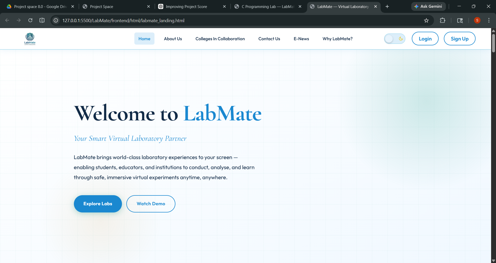
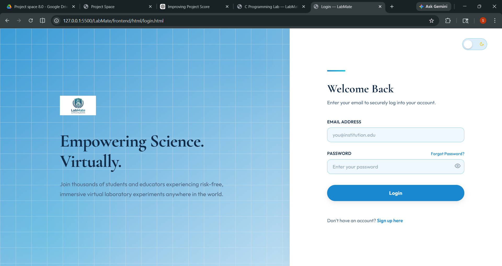
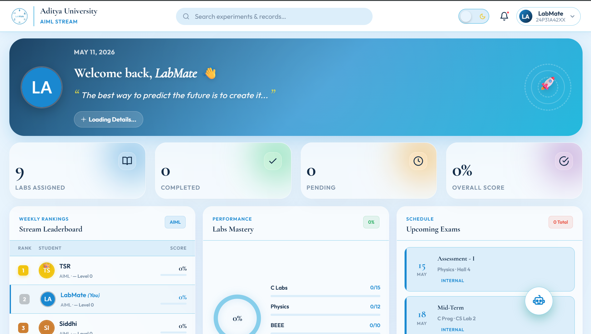
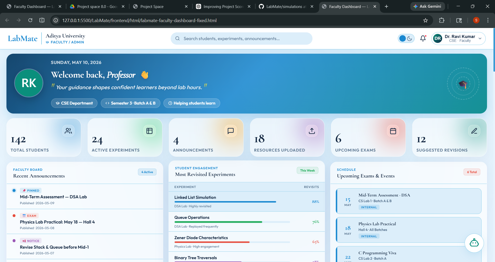
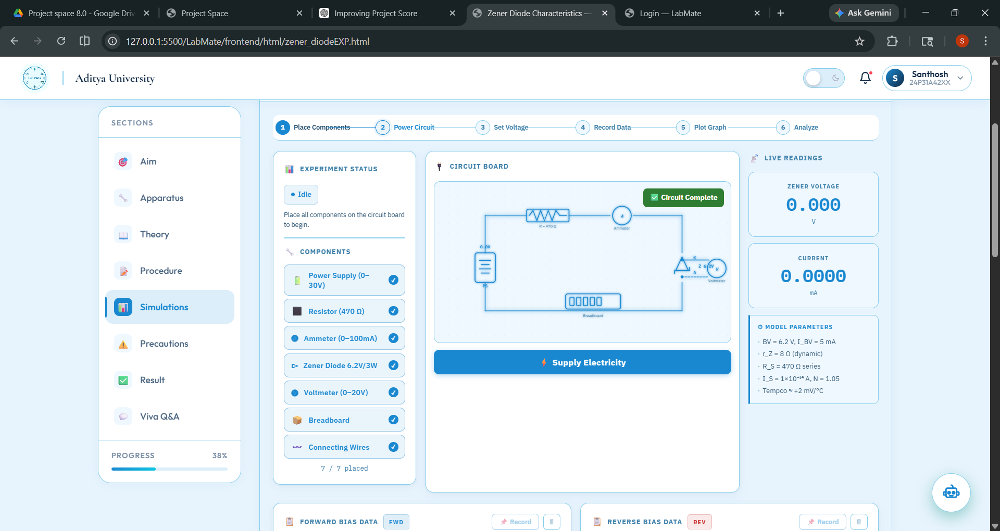
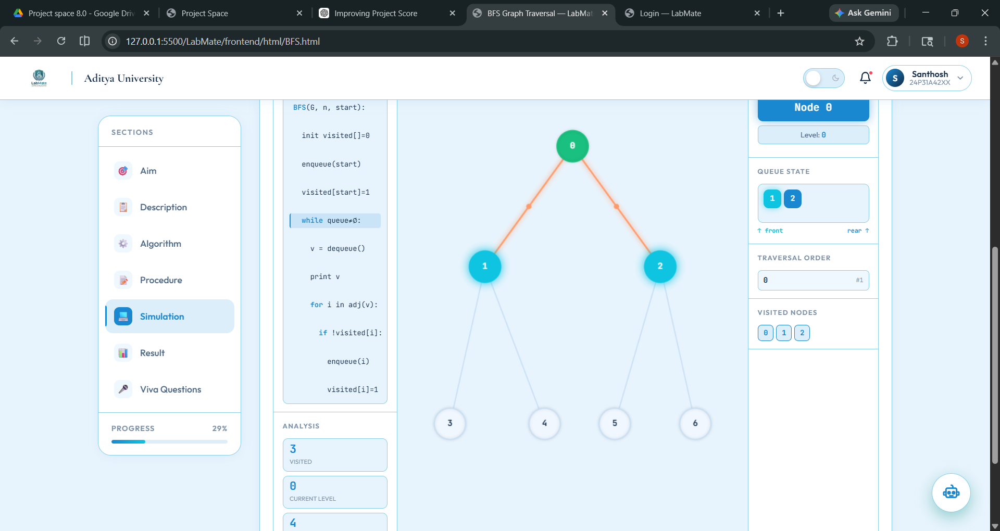
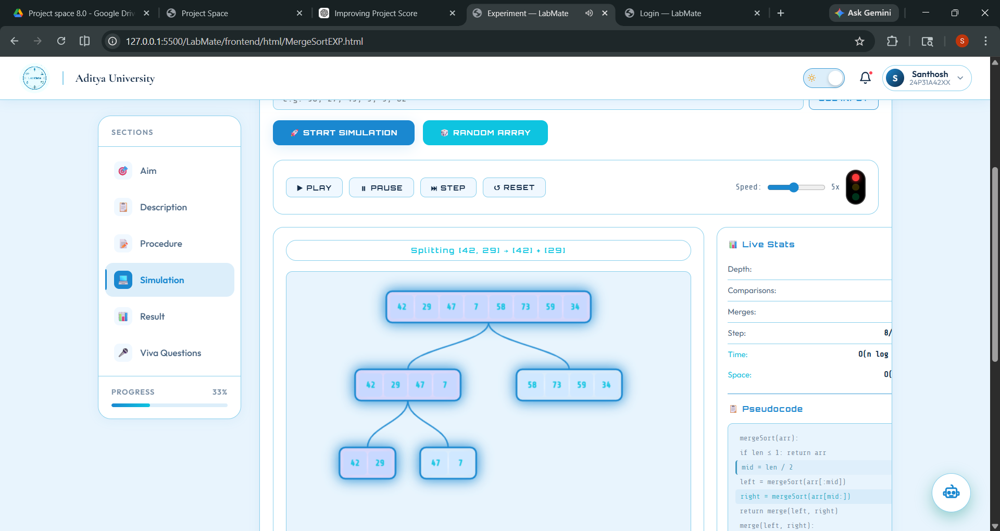
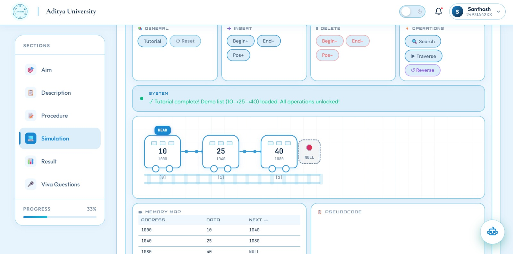
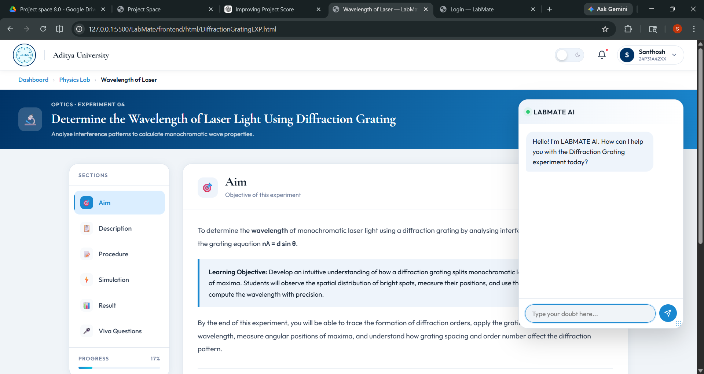

# LabMate AI

## 🚀 Smart Virtual Laboratory Platform for Engineering Students

LabMate AI is an interactive virtual laboratory platform designed to simplify practical learning for engineering students through simulations, dashboards, experiment management, and AI-assisted learning tools.

The platform combines virtual experiments, student progress tracking, faculty management, and intelligent assistance into a centralized learning environment.

---

# 📌 Features

## ✅ Implemented Features

### 🔐 Authentication System
- User Signup & Login
- JWT-based authentication
- Password hashing using bcrypt
- Email verification support
- Role-based structure

### 👨‍🎓 Student Dashboard
- Experiment modules
- Lab subject navigation
- Progress tracking
- Experiment access panel
- Responsive dashboard UI

### 👨‍🏫 Faculty Dashboard
- Faculty management interface
- Student monitoring structure
- Experiment management modules
- Submission overview interface

### 🧪 Virtual Lab Simulations
Implemented interactive simulations including:
- BFS Visualization
- DFS Visualization
- Merge Sort Simulation
- Bubble Sort Experiment
- Linked List Experiment
- Fibonacci Experiment
- Temperature Converter
- Logic Gate Simulation
- Diffraction Grating Experiment

### 🤖 AI Assistance
- AI chatbot interface
- Viva preparation support structure
- Experiment guidance modules

### 🎨 UI/UX
- Dark/Light Theme
- Fully Responsive Design
- Modern Dashboard Layout
- Sidebar Navigation
- Interactive Experiment Pages

---

# 🖼️ Project Screenshots

## Landing Page


---

## Login Page


---

## Student Dashboard


---

## Faculty Dashboard


---

## Simulations Module


---

## BFS Simulation


---

## Merge Sort Visualization


---

## Linked List Experiment


---

## AI Chat Assistant


---

# 🛠️ Tech Stack

## Frontend
- HTML
- CSS
- JavaScript

## Backend
- Node.js
- Express.js

## Database
- PostgreSQL

## Authentication & Security
- JWT Authentication
- bcrypt Password Hashing

## APIs & Tools
- Groq API
- GitHub

---

# 🏗️ System Architecture

LabMate AI follows a three-tier architecture:

## Frontend Layer
Provides responsive interfaces for:
- Students
- Faculty
- Simulations
- Dashboards

## Backend Layer
Handles:
- Authentication
- Routing
- API handling
- Experiment management
- Request processing

## Database Layer
Stores:
- User details
- Experiment data
- Progress records
- Submission information

---

# 📂 Project Structure

```bash
LabMate/
│
├── frontend/
│   ├── html/
│   ├── css/
│   └── js/
│
├── backend/
│   ├── config/
│   ├── controllers/
│   ├── routes/
│   └── server.js
│
├── database/
│   ├── schema.sql
│   └── seed.sql
│
├── docs/
│   ├── project-plan.md
│   └── sprint-plan.md
│
├── simulations/
│
└── README.md
```

---

# 📊 Current Implemented Modules

| Module | Status |
|---|---|
| Authentication | ✅ Completed |
| Student Dashboard | ✅ Completed |
| Faculty Dashboard | ✅ Completed |
| BFS Simulation | ✅ Completed |
| DFS Simulation | ✅ Completed |
| Merge Sort Visualization | ✅ Completed |
| Linked List Experiment | ✅ Completed |
| Responsive UI | ✅ Completed |
| Backend Routing | ✅ Completed |
| Database Schema | 🔄 In Progress |
| AI Integration | 🔄 In Progress |
| PDF Generation | 🔄 In Progress |

---

# 🎯 Future Enhancements

- AI-generated observation tables
- PDF lab report generation
- Advanced analytics dashboard
- Real-time experiment evaluation
- Viva voice assistant
- Experiment bookmarking
- Email notifications
- AI-generated summaries